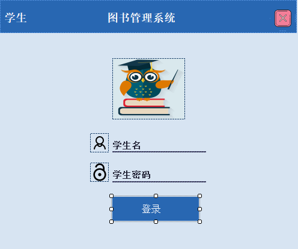

#### 文件摘要

#### 每个函数和重要组件的功能简介

#### 按键功能

#### 页面展示

## LMSProject

### 1. AddBook

这个文件定义了一个名为AddBook的窗体类，用于添加图书信息到数据库，并通过网络发送通知。

#### 文件摘要

文件定义了一个名为AddBook的Windows窗体，允许用户输入图书信息，并将这些信息保存到数据库。它还提供了取消输入的功能，以及在保存图书信息后通过TCP客户端发送消息的功能。这表明该窗体是图书馆管理系统的一部分，用于添加新书到图书馆的目录中。

#### 每个函数和重要组件的功能简介

- `AddBook`：该构造函数初始化窗体组件，并设置网络流和客户端的读取器（BinaryReader）和写入器（BinaryWriter）。
- `SendMessage`：这个方法负责将字符串消息写入网络流，发送到服务器。它使用BinaryWriter实例来写入消息，并刷新流以确保消息被发送。
- `circularPicture1_Click`：事件处理器，当用户点击一个圆形图片框时，会隐藏当前窗体。
- `panel5_Paint`：这是一个事件处理器，当窗体上的第五个面板需要重绘时会被调用。
- `dateTimePicker1_ValueChanged`：这是一个事件处理器，当用户更改日期选择器的值时会被调用。

#### 按键功能

- `btnSaveBook_Click`：这个方法在用户点击“保存图书”按钮时被调用。它首先检查是否所有必要的图书信息都已填写。如果信息完整，它会创建一个SqlConnection来连接数据库，并执行一个SQL命令以插入新的图书信息。如果操作成功，它会显示一个消息框通知用户，并通过网络发送一个确认消息。然后，它会清除所有文本框的内容。
- `btnBookCancel_Click`：当用户点击“取消”按钮时，这个方法会被调用，它会清除所有文本框的内容，以便用户可以重新开始输入。

#### 页面展示


### 2. AddStudent

这段代码是一个使用C#编写的Windows Forms应用程序的一部分，属于一个名为LMSProject（是一个图书馆管理系统）的项目。这个文件定义了一个名为AddStudent的窗体类，用于添加学生信息到数据库，并通过网络发送通知。

#### 文件摘要

文件定义了一个名为AddStudent的Windows窗体，允许用户输入学生信息，并将这些信息保存到数据库。它还提供了刷新输入字段的功能，以及在保存学生信息后通过TCP客户端发送消息的功能。这表明该窗体是图书馆管理系统的一部分，用于添加新学生到系统的目录中。

#### 每个函数和重要组件的功能简介

- `AddStudent`：该构造函数初始化窗体组件，并设置网络流和客户端的读取器（BinaryReader）和写入器（BinaryWriter）。
- `SendMessage`：这个方法负责将字符串消息写入网络流，发送到服务器。它使用BinaryWriter实例来写入消息，并刷新流以确保消息被发送。
- `jFlatButton2_Click`：这是一个事件处理器。
- `circularPicture1_Click`：事件处理器，当用户点击一个圆形图片框时，会隐藏当前窗体。
- `pictureBox4_Click`：这是一个事件处理器。

#### 按键功能

- `btnSaveStInfo_Click`：这个方法在用户点击“保存学生信息”按钮时被调用。它首先检查是否所有必要的学生信息都已填写。如果信息完整，它会创建一个SqlConnection来连接数据库，并执行一个SQL命令以插入新的学生信息。如果操作成功，它会显示一个消息框通知用户，并通过网络发送一个确认消息。然后，它会清除所有文本框的内容。
- `btnStInfoRefrsh_Click`：当用户点击“刷新”按钮时，这个方法会被调用，它会清除所有文本框的内容，以便用户可以重新开始输入。

#### 页面展示


### 3. BookSearch

这段代码是一个使用C#编写的Windows Forms应用程序的一部分，属于一个名为LMSProject（是一个图书馆管理系统）的项目。这个文件定义了一个名为BookSearch的窗体类，用于在数据库中搜索图书信息并显示结果。

#### 文件摘要

文件定义了一个名为BookSearch的Windows窗体，允许用户通过图书名称来搜索图书信息。它提供了实时搜索功能，并在dataGridView1控件中显示搜索结果。此外，它还提供了一个刷新按钮，用于清除搜索框并显示所有图书的信息。这个窗体是图书馆管理系统的一部分，用于帮助用户查找图书馆中的图书。

#### 每个函数和重要组件的功能简介

- `BookSearch`：构造函数，初始化窗体组件。
- `BookSearch_Load`：当窗体加载时，这个方法会被调用。它建立与数据库的连接，并执行一个SQL命令来选择所有图书的信息，然后将这些信息显示在dataGridView1控件中。
- `txtBookName_TextChanged`：这个方法在用户在txtBookName文本框中输入文本时被调用。它会根据用户输入的图书名称来过滤数据库中的记录，并更新dataGridView1控件以显示匹配的图书信息。如果文本框为空，它会显示所有图书的信息。

#### 按键功能

- `btnRefreshbkname_Click`：当用户点击“刷新”按钮时，这个方法会被调用，它会清除txtBookName文本框的内容，并重新加载所有图书的信息。
- `circularPicture1_Click`：事件处理器，当用户点击一个圆形图片框时，会隐藏当前窗体。

#### 页面展示


### 4.CircularPicture

这段代码是一个使用C#编写的自定义控件类，属于一个名为LMSProject的项目。这个文件定义了一个名为CircularPicture的类，它继承自PictureBox类，用于创建一个圆形的图片显示区域。

#### 文件摘要

文件定义了一个名为CircularPicture的自定义PictureBox控件，用于在窗体中显示圆形的图片。这个控件可以通过简单地改变PictureBox的显示区域来实现圆形效果，而不需要改变图片本身的形状。这个控件是用于图书馆管理系统的用户界面，以提供更现代化的视觉效果。

#### 类的功能简介

- `CircularPicture`：这个类继承自PictureBox，用于创建一个圆形的图片框。它通过重写OnPaint方法来改变PictureBox的显示区域为一个圆形。
- `OnPaint`：这个方法在PictureBox需要重绘时被调用。它创建一个GraphicsPath对象，并添加一个椭圆路径，该路径定义了PictureBox的显示区域。然后，它创建一个Region对象，并将其设置为PictureBox的Region属性，从而创建一个圆形的图片显示区域。最后，它调用基类的OnPaint方法来完成图片的绘制。

### 5. CompleteBookDetail

这段代码是一个使用C#编写的Windows Forms应用程序的一部分，属于一个名为LMSProject（可能是一个图书馆管理系统）的项目。这个文件定义了一个名为CompleteBookDetail的窗体类，用于显示图书的借阅和归还详细信息。

#### 文件摘要

文件定义了一个名为CompleteBookDetail的Windows窗体，用于显示图书馆中图书的借阅和归还详细信息。窗体加载时会从数据库中检索信息，并将未归还和已归还的图书信息分别显示在两个dataGridView控件中。这个窗体可能是图书馆管理系统的一部分，用于帮助图书馆管理员跟踪图书的借阅和归还状态。

#### 每个函数和重要组件的功能简介

- `CompleteBookDetail`：构造函数，初始化窗体组件。
- `circularPicture1_Click`：事件处理器，当用户点击一个圆形图片框时，会隐藏当前窗体。
- `CompleteBookDetail_Load`：当窗体加载时，这个方法会被调用。它建立与数据库的连接，并执行两个SQL命令来选择图书的借阅信息。第一个命令选择所有尚未归还的图书信息，第二个命令选择所有已经归还的图书信息。然后，这些信息分别显示在dataGridView1和dataGridView2控件中。

#### 页面展示


### 6.Dashboard

这段代码是一个使用C#编写的Windows Forms应用程序的一部分，属于一个名为LMSProject（可能是一个图书馆管理系统）的项目。这个文件定义了一个名为Dashboard的窗体类，它作为应用程序的主控界面，提供了访问系统各种功能的入口。

#### 文件摘要

文件定义了一个名为Dashboard的Windows窗体，作为图书馆管理系统的主控界面。它提供了多个菜单项，允许管理员或用户访问系统的不同部分，如添加新书、查看图书、管理学生信息、借书和还书等。点击这些菜单项时，窗体会发送消息到服务器，并显示相应的功能窗体。这个窗体是图书馆管理系统的核心，提供了系统的整体导航和功能访问。

#### 每个函数和重要组件的功能简介

- `Dashboard`：构造函数，初始化窗体组件，并设置网络流和客户端的读取器（BinaryReader）和写入器（BinaryWriter）。
- `panel1_Paint`, `panel4_Paint`, `panel2_Paint`：这些方法在各自的面板需要重绘时会被调用。
- `Dashboard_Load`：当窗体加载时，这个方法会被调用。
- `completeBookDetailToolStripMenuItem_Click`：事件处理器，当用户点击“BookDetail”菜单项时，会发送一条消息到服务器，并显示“CompleteBookDetail”窗体。
- `circularPicture1_Click`：事件处理器。
- `SendMessage`：这个方法负责将字符串消息写入网络流，发送到服务器。它使用BinaryWriter实例来写入消息，并刷新流以确保消息被发送。
- `circularProgressBar4_Click`：事件处理器。

#### 按键功能

- `dashboardToolStripMenuItem_Click`：事件处理器，当用户点击“home”菜单项时，会发送一条消息到服务器，并显示“HomePage”窗体。
- `addNewBookToolStripMenuItem_Click`：事件处理器，当用户点击“AddBook”菜单项时，会发送一条消息到服务器，并显示“AddBook”窗体。
- `viewBooksToolStripMenuItem_Click`：事件处理器，当用户点击“ViewBook”菜单项时，会发送一条消息到服务器，并显示“ViewBook”窗体。
- `viewStudentInfoToolStripMenuItem_Click`：事件处理器，当用户点击“ViewStudent”菜单项时，会发送一条消息到服务器，并显示“ViewStudent”窗体。
- `addNewStudentToolStripMenuItem_Click`：事件处理器，当用户点击“AddStudent”菜单项时，会发送一条消息到服务器，并显示“AddStudent”窗体。
- `logOutToolStripMenuItem_Click`：事件处理器，当用户点击“logOut”菜单项时，会发送一条消息到服务器，并隐藏当前窗体。
- `issueBookToolStripMenuItem_Click`：事件处理器，当用户点击“issueBook”菜单项时，会发送一条消息到服务器，并显示“IssueBook”窗体。
- `returNBookToolStripMenuItem_Click`：事件处理器，当用户点击“ReturnBook”菜单项时，会发送一条消息到服务器，并显示“ReturnBook”窗体。

#### 页面展示


###  7.HomePage

这段代码是一个使用C#编写的Windows Forms应用程序的一部分，属于一个名为LMSProject（可能是一个图书馆管理系统）的项目。这个文件定义了一个名为HomePage的窗体类，它作为应用程序的首页，允许用户选择以管理员或学生身份登录，或者进行图书搜索。

#### 文件摘要

文件定义了一个名为HomePage的Windows窗体，作为图书馆管理系统的首页。它提供了一个菜单栏，允许用户选择以管理员或学生身份登录，或者进行图书搜索。点击这些菜单项时，窗体会发送消息到服务器，并显示相应的登录或搜索窗体。这个窗体是用户进入图书馆管理系统的入口点，提供了登录和搜索的基本功能。

#### 每个函数和重要组件的功能简介

- `HomePage`：构造函数，初始化窗体组件，并创建一个TcpClient实例来连接到服务器，同时设置网络流和客户端的读取器（BinaryReader）和写入器（BinaryWriter）。
- `menuStrip1_ItemClicked`：这个事件处理器在菜单项被点击时会被调用。
- `SendMessage`：这个方法负责将字符串消息写入网络流，发送到服务器。它使用BinaryWriter实例来写入消息，并刷新流以确保消息被发送。

#### 按键功能

- `adminToolStripMenuItem_Click`：事件处理器，当用户点击“管理员登录”菜单项时，会发送一条消息到服务器，并显示“Login”窗体，以便管理员登录。
- `studentToolStripMenuItem_Click`：事件处理器，当用户点击“学生登录”菜单项时，会发送一条消息到服务器，并显示“StudentLogin”窗体，以便学生登录。
- `booksToolStripMenuItem_Click`：事件处理器，当用户点击“图书搜索”菜单项时，会发送一条消息到服务器，并显示“BookSearch”窗体，以便用户搜索图书。
- `circularPicture1_Click`：事件处理器，当用户点击圆形图片框时，会隐藏当前窗体。
  文件摘要：

#### 页面展示


### 8. IssueBook

这段代码是一个使用C#编写的Windows Forms应用程序的一部分，属于一个名为LMSProject（可能是一个图书馆管理系统）的项目。这个文件定义了一个名为IssueBook的窗体类，用于处理图书的借阅流程。

#### 文件摘要

文件定义了一个名为IssueBook的Windows窗体，用于处理图书馆中图书的借阅流程。窗体加载时会从数据库中检索所有图书的名称，并显示在comboBoxBK控件中。用户可以输入学生编号来搜索学生信息，选择图书并填写必要的学生信息来完成借阅流程。这个窗体可能是图书馆管理系统的一部分，用于帮助用户和管理员借阅图书。

#### 每个函数和重要组件的功能简介

- `IssueBook`：构造函数，初始化窗体组件，并设置网络流和客户端的读取器（BinaryReader）和写入器（BinaryWriter）。
- `SendMessage`：这个方法负责将字符串消息写入网络流，发送到服务器。它使用BinaryWriter实例来写入消息，并刷新流以确保消息被发送。
- `IssueBook_Load`：当窗体加载时，这个方法会被调用。它建立与数据库的连接，并执行一个SQL命令来选择所有图书的名称，然后将这些名称添加到comboBoxBK控件中。
- `circularPicture1_Click`：事件处理器，当用户点击一个圆形图片框时，会隐藏当前窗体。
- `jFlatButton1_Click`：这是一个事件处理器。
- `panel5_Paint`：这是一个事件处理器。

#### 按键功能

- `btnStRefresh_Click`：当用户点击“刷新”按钮时，这个方法会被调用，它会清除所有与学生信息相关的文本框的内容。
- `btnSearchSt_Click`：当用户点击“搜索学生”按钮时，这个方法会被调用。它首先检查学生编号是否填写，然后建立与数据库的连接，并执行一个SQL命令来选择与该编号对应的学生信息。如果找到匹配的学生信息，它会显示该学生的详细信息。如果未找到匹配的学生信息，它会显示一个错误消息。
- `btnIssueBk_Click`：当用户点击“借阅图书”按钮时，这个方法会被调用。它首先检查所有必要的学生信息是否填写，然后检查是否选择了图书并检查学生是否已达到借阅上限。如果所有条件都满足，它会建立与数据库的连接，并执行一个SQL命令来插入新的借阅记录。如果操作成功，它会显示一个消息框通知用户，并通过网络发送一个确认消息。然后，它会清除所有文本框的内容。
- `txtStNumber_TextChanged`：当用户在txtStNumber文本框中输入文本时，这个方法会被调用。如果文本框为空，它会清除所有与学生信息相关的文本框的内容。

#### 页面展示


### 9.Login

这段代码是一个使用C#编写的Windows Forms应用程序的一部分，属于一个名为LMSProject（可能是一个图书馆管理系统）的项目。这个文件定义了一个名为Login的窗体类，用于处理管理员登录到图书馆管理系统。

#### 文件摘要

文件定义了一个名为Login的Windows窗体，用于管理员登录到图书馆管理系统。窗体加载时，会显示两个文本框，分别用于输入用户名和密码。点击“登录”按钮后，窗体会与数据库进行通信，以验证用户名和密码。如果验证成功，管理员将被带到“Dashboard”窗体，并发送一个登录成功的消息。如果验证失败，管理员会收到一个错误消息，并发送一个登录失败的消息。

#### 每个函数和重要组件的功能简介

- `Login`：构造函数，初始化窗体组件，并设置网络流和客户端的读取器（BinaryReader）和写入器（BinaryWriter）。
- `panel1_Paint`：这是一个事件处理器。
- `SendMessage`：这个方法负责将字符串消息写入网络流，发送到服务器。它使用BinaryWriter实例来写入消息，并刷新流以确保消息被发送。
- `circularPicture1_Click`：事件处理器，当用户点击一个圆形图片框时，会隐藏当前窗体。
- `txtusername_MouseClick`：事件处理器，当用户点击用户名文本框时，如果文本框中显示的是默认文本“UserName”，它会清除文本框的内容。
- `txtpassword_MouseClick`：事件处理器，当用户点击密码文本框时，如果文本框中显示的是默认文本“Password”，它会清除文本框的内容，并设置密码为密码模式。

#### 按键功能

`LoginBtn_Click`：当用户点击“登录”按钮时，这个方法会被调用。它建立与数据库的连接，并执行一个SQL命令来检查用户名和密码是否匹配。如果匹配，它会隐藏当前窗体，显示“Dashboard”窗体，并通过网络发送一个登录成功的消息。如果用户名或密码不匹配，它会显示一个错误消息，并通过网络发送一个登录失败的消息。

#### 页面展示


### 10. ReturnBook

这段代码是一个使用C#编写的Windows Forms应用程序的一部分，属于一个名为LMSProject（可能是一个图书馆管理系统）的项目。这个文件定义了一个名为ReturnBook的窗体类，用于处理图书馆中图书的归还流程。

#### 文件摘要

文件定义了一个名为ReturnBook的Windows窗体，用于处理图书馆中图书的归还流程。窗体加载时，会显示两个文本框，分别用于输入学生编号和图书名称。点击“搜索学生”按钮后，窗体会与数据库进行通信，以验证学生编号和图书名称。如果验证成功，管理员将被带到“Dashboard”窗体，并发送一个登录成功的消息。如果验证失败，管理员会收到一个错误消息，并发送一个登录失败的消息。

#### 每个函数和重要组件的功能简介

- `ReturnBook`：构造函数，初始化窗体组件，并设置网络流和客户端的读取器（BinaryReader）和写入器（BinaryWriter）。
- `panel5_Paint`：这是一个事件处理器。
- `circularPicture1_Click`：事件处理器，当用户点击一个圆形图片框时，会隐藏当前窗体。
- `jFlatButton5_Click`：这是一个事件处理器。
- `jFlatButton2_Click`：这是一个事件处理器。
- `pictureBox2_Click`：这是一个事件处理器。
- `pictureBox4_Click`：这是一个事件处理器。
- `btnStSearch_Click`：当用户点击“搜索学生”按钮时，这个方法会被调用。它首先检查学生编号是否填写，然后建立与数据库的连接，并执行一个SQL命令来选择与该编号对应的学生借阅的图书信息。如果找到匹配的借阅信息，它会显示在dataGridView1控件中。如果未找到匹配的借阅信息，它会显示一个错误消息。
- `dataGridView1_CellClick`：事件处理器，当用户在dataGridView1控件中点击单元格时，这个方法会被调用。它会将选中的图书名称和借阅日期显示在txtBkName和txtBkIssueDate文本框中。
- `SendMessage`：这个方法负责将字符串消息写入网络流，发送到服务器。它使用BinaryWriter实例来写入消息，并刷新流以确保消息被发送。

#### 按键功能

- `btnbkreturn_Click`：当用户点击“归还图书”按钮时，这个方法会被调用。它首先检查学生编号和图书名称是否填写，然后建立与数据库的连接，并执行一个SQL命令来更新借阅记录，设置归还日期。如果操作成功，它会显示一个消息框通知用户，并通过网络发送一个归还成功的消息。
- `txtStNumber_TextChanged`：当用户在txtStNumber文本框中输入文本时，这个方法会被调用。如果文本框为空，它会清除dataGridView1控件的DataSource，并清除与图书名称和借阅日期相关的文本框的内容。
- `btnStRefresh_Click`：当用户点击“刷新”按钮时，这个方法会被调用，它会清除txtStNumber文本框的内容。

#### 页面展示


### 11.StudentDashboard

这段代码是一个使用C#编写的Windows Forms应用程序的一部分，属于一个名为LMSProject（可能是一个图书馆管理系统）的项目。这个文件定义了一个名为ReturnBook的窗体类，用于处理图书馆中图书的归还流程。

#### 文件摘要

文件定义了一个名为ReturnBook的Windows窗体，用于处理图书馆中图书的归还流程。窗体加载时，会显示两个文本框，分别用于输入学生编号和图书名称。点击“搜索学生”按钮后，窗体会与数据库进行通信，以验证学生编号和图书名称。如果验证成功，管理员将被带到“Dashboard”窗体，并发送一个登录成功的消息。如果验证失败，管理员会收到一个错误消息，并发送一个登录失败的消息。

#### 每个函数和重要组件的功能简介

- `ReturnBook`：构造函数，初始化窗体组件，并设置网络流和客户端的读取器（BinaryReader）和写入器（BinaryWriter）。
- `panel5_Paint`：这是一个事件处理器。
- `circularPicture1_Click`：事件处理器，当用户点击一个圆形图片框时，会隐藏当前窗体。
- `jFlatButton5_Click`：这是一个事件处理器。
- `jFlatButton2_Click`：这是一个事件处理器。
- `pictureBox2_Click`：这是一个事件处理器。
- `pictureBox4_Click`：这是一个事件处理器。

#### 按键功能

- `btnStSearch_Click`：当用户点击“搜索学生”按钮时，这个方法会被调用。它首先检查学生编号是否填写，然后建立与数据库的连接，并执行一个SQL命令来选择与该编号对应的学生借阅的图书信息。如果找到匹配的借阅信息，它会显示在dataGridView1控件中。如果未找到匹配的借阅信息，它会显示一个错误消息。
- `dataGridView1_CellClick`：事件处理器，当用户在dataGridView1控件中点击单元格时，这个方法会被调用。它会将选中的图书名称和借阅日期显示在txtBkName和txtBkIssueDate文本框中。
- `SendMessage`：这个方法负责将字符串消息写入网络流，发送到服务器。它使用BinaryWriter实例来写入消息，并刷新流以确保消息被发送。
- `btnbkreturn_Click`：当用户点击“归还图书”按钮时，这个方法会被调用。它首先检查学生编号和图书名称是否填写，然后建立与数据库的连接，并执行一个SQL命令来更新借阅记录，设置归还日期。如果操作成功，它会显示一个消息框通知用户，并通过网络发送一个归还成功的消息。
- `txtStNumber_TextChanged`：当用户在txtStNumber文本框中输入文本时，这个方法会被调用。如果文本框为空，它会清除dataGridView1控件的DataSource，并清除与图书名称和借阅日期相关的文本框的内容。
- `btnStRefresh_Click`：当用户点击“刷新”按钮时，这个方法会被调用，它会清除txtStNumber文本框的内容。

#### 页面展示


### 12. StudentLogin

这段代码是一个使用C#编写的Windows Forms应用程序的一部分，属于一个名为LMSProject（可能是一个图书馆管理系统）的项目。这个文件定义了一个名为StudentLogin的窗体类，用于处理学生登录到图书馆管理系统。

#### 文件摘要

文件定义了一个名为StudentLogin的Windows窗体，用于学生登录到图书馆管理系统。窗体加载时，会显示两个文本框，分别用于输入学生姓名和学号。点击“登录”按钮后，窗体会与数据库进行通信，以验证学生姓名和学号。如果验证成功，学生将被带到“StudentDashboard”窗体，并发送一个登录成功的消息。如果验证失败，学生会收到一个错误消息，并发送一个登录失败的消息。

#### 每个函数和重要组件的功能简介

- `StudentLogin`：构造函数，初始化窗体组件，并设置网络流和客户端的读取器（BinaryReader）和写入器（BinaryWriter）。
- `SendMessage`：这个方法负责将字符串消息写入网络流，发送到服务器。它使用BinaryWriter实例来写入消息，并刷新流以确保消息被发送。
- `txtusername_MouseClick`：事件处理器，当用户点击学生姓名文本框时，如果文本框中显示的是默认文本“StudentName”，它会清除文本框的内容。
- `txtpassword_MouseClick`：事件处理器，当用户点击学号文本框时，如果文本框中显示的是默认文本“StudentNumber”，它会清除文本框的内容，并设置学号为密码模式。
- `circularPicture1_Click`：事件处理器，当用户点击一个圆形图片框时，会隐藏当前窗体。

#### 按键功能

`LoginBtn_Click`：当用户点击“登录”按钮时，这个方法会被调用。它建立与数据库的连接，并执行一个SQL命令来检查学生姓名和学号是否匹配。如果匹配，它会隐藏当前窗体，显示“StudentDashboard”窗体，并通过网络发送一个登录成功的消息。如果学生姓名或学号不匹配，它会显示一个错误消息，并通过网络发送一个登录失败的消息。

#### 页面展示




### 13. ViewBook

这段代码是一个使用C#编写的Windows Forms应用程序的一部分，属于一个名为LMSProject（可能是一个图书馆管理系统）的项目。这个文件定义了一个名为ViewBook的窗体类，用于显示和管理图书馆的图书信息。

#### 文件摘要

文件定义了一个名为ViewBook的Windows窗体，用于显示和管理图书馆的图书信息。窗体加载时会从数据库中检索所有图书的信息，并显示在dataGridView1控件中。用户可以输入图书名称来搜索图书信息，点击数据网格中的行来查看或编辑图书的详细信息，以及更新或删除图书信息。这个窗体可能是图书馆管理系统的一部分，用于帮助管理员管理图书馆的图书。

#### 每个函数和重要组件的功能简介

- `ViewBook`：构造函数，初始化窗体组件。
- `ViewBook_Load`：当窗体加载时，这个方法会被调用。它建立与数据库的连接，并执行一个SQL命令来选择所有图书的信息，然后将这些信息显示在dataGridView1控件中。
- `circularPicture3_Click`：这是一个事件处理器，但在这个代码片段中没有实现具体的功能。
- `RefreshBtn_Click`：当用户点击“刷新”按钮时，这个方法会被调用，它会清除所有文本框的内容。
- `label4_Click`：这是一个事件处理器，但在这个代码片段中没有实现具体的功能。
- `circularPicture1_Click`：事件处理器，当用户点击一个圆形图片框时，会隐藏当前窗体。
- `textBox1_TextChanged`：这是一个事件处理器，但在这个代码片段中没有实现具体的功能。

#### 按键功能

- `dataGridView1_CellClick`：事件处理器，当用户在dataGridView1控件中点击单元格时，这个方法会被调用。它会将选中的图书ID存储在bkId变量中，并建立与数据库的连接，执行一个SQL命令来选择与该ID对应的图书详细信息，并显示在相应的文本框中。
- `txtBookName_TextChanged`：当用户在txtBookName文本框中输入文本时，这个方法会被调用。它会根据用户输入的图书名称来过滤数据库中的记录，并更新dataGridView1控件以显示匹配的图书信息。如果文本框为空，它会显示所有图书的信息。
- `btnBkInfosRefresh_Click`：当用户点击“刷新”按钮时，这个方法会被调用，它会清除所有与图书信息相关的文本框的内容。
- `btnBkInfosUpdate_Click`：当用户点击“更新图书信息”按钮时，这个方法会被调用。它会显示一个确认对话框，如果用户确认，它会建立与数据库的连接，并执行一个SQL命令来更新选中图书的信息。如果操作成功，它会显示一个消息框通知用户，并清除所有文本框的内容。
- `btnBkDelete_Click`：当用户点击“删除图书”按钮时，这个方法会被调用。它会显示一个确认对话框，如果用户确认，它会建立与数据库的连接，并执行一个SQL命令来删除选中图书的信息。如果操作成功，它会显示一个消息框通知用户。

#### 页面展示


### 14. ViewStudent

这段代码是一个使用C#编写的Windows Forms应用程序的一部分，属于一个名为LMSProject（可能是一个图书馆管理系统）的项目。这个文件定义了一个名为ViewStudent的窗体类，用于显示和管理图书馆的学生信息。

#### 文件摘要

文件定义了一个名为ViewStudent的Windows窗体，用于显示和管理图书馆的学生信息。窗体加载时会从数据库中检索所有学生的信息，并显示在dataGridView1控件中。用户可以输入学生姓名来搜索学生信息，点击数据网格中的行来查看或编辑学生的详细信息，以及更新或删除学生信息。这个窗体可能是图书馆管理系统的一部分，用于帮助管理员管理图书馆的学生。

#### 每个函数和重要组件的功能简介

- `ViewStudent`：构造函数，初始化窗体组件。
- `circularPicture1_Click`：事件处理器，当用户点击一个圆形图片框时，会隐藏当前窗体。
- `dataGridView1_CellContentClick`：这是一个事件处理器，但在这个代码片段中没有实现具体的功能。
- `panel5_Paint`：这是一个事件处理器，但在这个代码片段中没有实现具体的功能。
- `ViewStudent_Load`：当窗体加载时，这个方法会被调用。它建立与数据库的连接，并执行一个SQL命令来选择所有学生的信息，然后将这些信息显示在dataGridView1控件中。
- `dataGridView1_CellClick`：事件处理器，当用户在dataGridView1控件中点击单元格时，这个方法会被调用。它会将选中的学生ID存储在stId变量中，并建立与数据库的连接，执行一个SQL命令来选择与该ID对应的学生详细信息，并显示在相应的文本框中。

#### 按键功能

- `txtStudentname_TextChanged`：当用户在txtStudentname文本框中输入文本时，这个方法会被调用。它会根据用户输入的学生姓名来过滤数据库中的记录，并更新dataGridView1控件以显示匹配的学生信息。如果文本框为空，它会显示所有学生的信息。
- `btnStNameRefresh_Click`：当用户点击“刷新”按钮时，这个方法会被调用，它会清除txtStudentname文本框的内容。
- `btnStInofRefresh_Click`：当用户点击“刷新学生信息”按钮时，这个方法会被调用，它会清除所有与学生信息相关的文本框的内容。
- `btnStUpdate_Click`：当用户点击“更新学生信息”按钮时，这个方法会被调用。它会显示一个确认对话框，如果用户确认，它会建立与数据库的连接，并执行一个SQL命令来更新选中学生信息。如果操作成功，它会显示一个消息框通知用户，并清除所有文本框的内容。
- `btnStDelete_Click`：当用户点击“删除学生”按钮时，这个方法会被调用。它会显示一个确认对话框，如果用户确认，它会建立与数据库的连接，并执行一个SQL命令来删除选中学生信息。如果操作成功，它会显示一个消息框通知用户。

#### 页面展示


## Server

这段代码是一个使用C#编写的Windows Forms应用程序的一部分，属于一个名为Server的项目。这个文件定义了一个名为Form1的窗体类，用于监听TCP连接并接收来自客户端的消息。

#### 文件摘要

文件定义了一个名为Form1的Windows窗体，用于创建一个TcpListener，监听本地回环地址上的端口3033。当有客户端连接时，它会创建一个新的TcpClient，并从网络流中读取消息。这些消息会被显示在窗体的文本框中。这个窗体可能是服务器应用程序的一部分，用于监听和接收客户端的TCP连接和消息。

#### 每个函数和重要组件的功能简介

- `Form1`：构造函数，初始化窗体组件。
- `button1_Click`：当用户点击“开始监听”按钮时，这个方法会被调用。它会创建一个TcpListener对象，监听本地回环地址（IPAddress.Loopback）上的端口3033。然后，它会启动一个后台线程（RecConnect），该线程会持续监听并接受来自客户端的TCP连接。
- `RecConnect`：后台线程的方法，用于持续监听TcpListener的连接。当有客户端连接时，它会创建一个新的TcpClient对象，并从网络流中读取BinaryReader和BinaryWriter对象。然后，它会启动一个新的后台线程（ReceiveFromClient），用于接收客户端的消息。
- `ReceiveFromClient`：后台线程的方法，用于从客户端接收消息。它会持续从网络流中读取字符串，并在窗体的文本框中显示接收到的消息。

#### 代码逻辑

在主页面通过构造方法创建客户端并连接服务端

```C#
 TcpClient client;
 private BinaryReader br;
 private BinaryWriter bw;
 NetworkStream ns;
 public HomePage()
 {
     InitializeComponent();
     // 创建客户端，与服务端连接
     client = new TcpClient();
     client.Connect("127.0.0.1", 3033);
     ns = client.GetStream();
     br = new BinaryReader(ns);
     bw = new BinaryWriter(ns);
 }
```

由于仅有监听功能，客户端无需新建线程等待服务端消息，仅仅使用`SendMessage`函数与服务端通信即可。

对于服务端，由于服务端不得不与多台客户端间进行通讯，所以运用多线程技术成为必要条件，我们在服务端一旦开始监听后，一但接收到新的客户端连接，新建后台线程来完成通讯。

```C#
 private void button1_Click(object sender, EventArgs e)
 {
     listener = new TcpListener(IPAddress.Loopback, 3033);
     listener.Start();

     this.Invoke((MethodInvoker)delegate
     {
         textBox1.AppendText("已开始监听" + Environment.NewLine);
     });
     Thread t = new Thread(RecConnect);
     t.IsBackground = true;
     t.Start();
 }
```

```C#
 private void RecConnect()
 {
     while (true)
     {   //接受传入的TCP连接请求，并返回一个TcpClient对象client
         TcpClient client = listener.AcceptTcpClient();
         NetworkStream networkStream = client.GetStream();
         br = new BinaryReader(networkStream);
         bw = new BinaryWriter(networkStream);
         Thread t = new Thread(ReceiveFromClient);
         t.IsBackground = true;
         t.Start();
     }
 }
```

并将接收到的信息打印在`textBox`文本框中

```C#
   public void ReceiveFromClient()
   {
       while (true)
       {
           string receiveString = null;
           try
           {
               receiveString = br.ReadString();
           }
           catch
           {
               return;
           }
           this.Invoke((MethodInvoker)delegate
           {
               textBox1.AppendText(receiveString+"\r\n");
           });
           
       }
   }
```

需要注意的是，每次更新页面时，需要将客户端的`client`作为构造函数传入新页面，以保证连接不中断，如下为跳转`login`页面的操作与构造函数实现：

跳转:

```C#
 private void adminToolStripMenuItem_Click(object sender, EventArgs e)
 {
     SendMessage("用户尝试以管理员身份登录");
     Login admin = new Login(client);
     admin.Show();
 }
```

`login`构造函数实现与`SendMessage`函数继承

```C#
 TcpClient client;
 private BinaryReader br;
 private BinaryWriter bw;
 NetworkStream ns;

 public Login(TcpClient tcpClient)
 {
     InitializeComponent();
     client = tcpClient;
     ns = client.GetStream();
     br = new BinaryReader(ns);
     bw = new BinaryWriter(ns);
 }

 private void SendMessage(string message)
     {
         try
         {
             //将字符串写入网络流，此方法会自动附加字符串长度前缀
             bw.Write(message);
             bw.Flush();
         }
         catch
         {

         }
     }
```

这样，在新页面中，我们仍然可通过`SendMessage`方法与服务端通信

```C#
  private void LoginBtn_Click(object sender, EventArgs e)
  {
      String CS = "data source=.; database = LMSDB; integrated security=SSPI";
      using (SqlConnection con = new SqlConnection(CS))
      {
          SqlCommand cmd = new SqlCommand("Select *from tblLogin where UserName='" + txtusername.Text + "' and Password ='" + txtpassword.Text + "' ", con);
          con.Open();
          SqlDataAdapter da = new SqlDataAdapter(cmd);
          DataTable dt = new DataTable();
          da.Fill(dt);
          if (dt.Rows.Count != 0)
          {
              Dashboard das = new Dashboard(client);
              this.Hide();
              das.Show();
              SendMessage("管理员" + txtusername.Text + "登录成功");
          }

          else
          {
              MessageBox.Show("Wrong Username OR Password", "Error", MessageBoxButtons.OK, MessageBoxIcon.Error);
              SendMessage("管理员" + txtusername.Text + "登录失败");
          }
      }
  }
```

至于其余模块的监听工作实现，原理仍如上所示。

#### 页面展示


